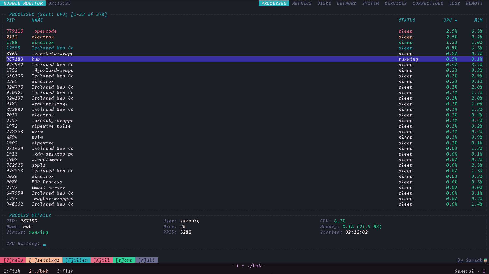

# bubbleMonitor

[](https://golang.org/dl/)
[](https://github.com/N1xev/bubbleMonitor/releases)
[](LICENSE)

A beautiful terminal-based system monitor built with Go and BubbleTea. Track your system metrics in real-time with a slick TUI interface.

**"shows you only what you want to see! 😄"**



## Features

- CPU (per-core and total)
- Memory, swap
- Disk usage, I/O rates
- Network throughput
- Processes: kill, suspend, resume, tree view, filter, bookmarks
- GPU: NVIDIA, AMD
- Temperatures, battery
- Docker, Kubernetes containers
- VM detection
- Health score (0-100%)
- Alerts when thresholds exceeded
- SSH remote monitoring

## Install

### Go

```bash
go install github.com/N1xev/bubbleMonitor/cmd/bub@latest
```

### Linux

```bash
curl -L https://github.com/N1xev/bubbleMonitor/releases/latest/download/bubbleMonitor_linux_amd64.tar.gz -o bub.tar.gz
tar -xzf bub.tar.gz
sudo mv bubbleMonitor_linux_amd64_v1/bub /usr/local/bin/
rm bub.tar.gz
```

### macOS

```bash
curl -L https://github.com/N1xev/bubbleMonitor/releases/latest/download/bubbleMonitor_darwin_amd64.tar.gz -o bub.tar.gz
tar -xzf bub.tar.gz
sudo mv bubbleMonitor_darwin_amd64_v1/bub /usr/local/bin/
rm bub.tar.gz
```

### Windows

```powershell
curl -L https://github.com/N1xev/bubbleMonitor/releases/latest/download/bubbleMonitor_windows_amd64.zip -o bub.zip
Expand-Archive bub.zip
```

## Build from Source

```bash
git clone https://github.com/N1xev/bubbleMonitor.git
cd bubbleMonitor
go install ./cmd/bub
```

## Keys

`1-9` - Switch tabs
`tab` - Next tab
`↑↓` - Move
`q` - Quit
`?` - Help
`.` - Settings
`K` - Kill process
`f` - Filter
`s` - Sort
`T` - Tree view

## Configuration

bubbleMonitor creates a config file at `~/.config/bubble-monitor/config.json` with sensible defaults. Tweak the refresh rate, history length, theme, or set custom alert thresholds for CPU, memory, disk, and temperature.

Want your own colors? Switch to the `custom` theme and define your palette:

```json
{
  "theme": "custom",
  "custom_theme": {
    "primary": "#7D56F4",
    "secondary": "#EE6FF8",
    "success": "#A1E3AD",
    "warning": "#F5A962",
    "alert": "#F25D94"
  }
}
```

## Platform Notes

Most features work everywhere, but there are a few quirks:

- **Linux**: Full support for everything, including GPU monitoring via NVML (NVIDIA) and AMD SMI.
- **macOS**: GPU info via `system_profiler`. Load averages show as "N/A".
- **Windows**: GPU name via `wmic`. Temperature monitoring might need admin privileges. Load averages aren't available.

## Contributing

Found a bug or have an idea? Open an issue or submit a pull request! Fork the repo, create a branch, make your changes, and send it over.

```bash
git checkout -b feature/cool-new-thing
git commit -m 'Add cool new thing'
git push origin feature/cool-new-thing
```

## Built With

- [BubbleTea](https://github.com/charmbracelet/bubbletea) - The amazing TUI framework
- [Lipgloss](https://github.com/charmbracelet/lipgloss) - For making things pretty
- [gopsutil](https://github.com/shirou/gopsutil) - Cross-platform system info
- [battery](https://github.com/distatus/battery) - Battery monitoring

## License

GNU Affero General Public License v3.0 - see [LICENSE](LICENSE) for details.

---

**Made with ❤️ by [Alaa Elsamouly](https://github.com/N1xev)**
